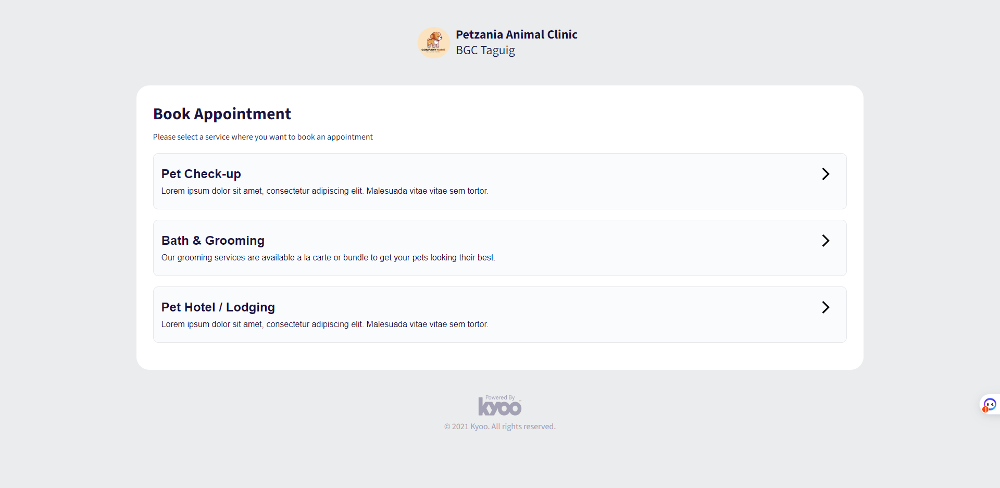

# AppointmentBookingApp

> This appointment booking app was developed using AngularJS with Typescript. It also used a mockAPI to provide information about the services and available timeslots that the system can provide. 
>
> Process:
>
> Step 1. The user will need to choose what services they want.
> 
> Step 2. The user will need to choose what type of services they want based on what they chose in Step 1.
> 
> Step 3. The user will need to choose the date and timeslot they wanted to book.
> 
> Step 4. The user will need to provide his/her personal details and remarks.
> 
> Step 5. The user will need to check the information in the summary page.
> 
> Step 6. The user can now get a screenshot of their receipt for the booking.
>
## LANDING PAGE (SCREENSHOT):

(https://rosciditech-digidev.github.io/appointment-booking-app/)

## Development server

Run `ng serve` for a dev server. Navigate to `http://localhost:4200/`. The application will automatically reload if you change any of the source files.

## Code scaffolding

Run `ng generate component component-name` to generate a new component. You can also use `ng generate directive|pipe|service|class|guard|interface|enum|module`.

## Build

Run `ng build` to build the project. The build artifacts will be stored in the `dist/` directory.

## Running unit tests

Run `ng test` to execute the unit tests via [Karma](https://karma-runner.github.io).

## Running end-to-end tests

Run `ng e2e` to execute the end-to-end tests via a platform of your choice. To use this command, you need to first add a package that implements end-to-end testing capabilities.

## Further help

To get more help on the Angular CLI use `ng help` or go check out the [Angular CLI Overview and Command Reference](https://angular.io/cli) page.
